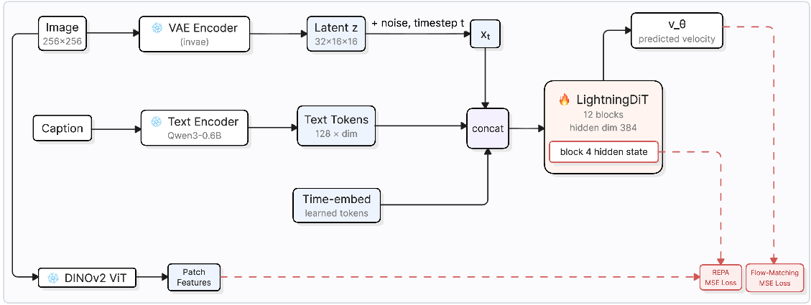

# An Affordable Recipe for Training Diffusion Transformers

### Dog-breed text-to-image diffusion, from pretraining to fine-tuning, on 4 consumer GPUs



> **The headline result.** Training diffusion transformers is usually presented as something
> that requires industrial-scale compute. This notebook is the result of two months of
> empirically comparing image tokenizers, latent-space parameterizations, and training
> hyperparameters — converging on a configuration that pretrains a working text-to-image
> Diffusion Transformer (DiT) to **sub-10 FID in 2.5 hours**, then fine-tunes it in **20 more
> minutes**, on **4×RTX 3090 (24GB)** — hardware you can rent by the hour. At Aug-2026 quoted
> rates (Vast.ai \$0.25/GPU/hr, RunPod \$0.46/GPU/hr), that's roughly **\$3–\$5 of total rented
> compute** for the whole pipeline.

**No pretrained weights are distributed.** You download the raw datasets and train both
stages yourself — every checkpoint you get is your own, and every number in this notebook is
reproducible from scratch.

## What's in [`dog_t2i_diffusion_tutorial.ipynb`](dog_t2i_diffusion_tutorial.ipynb)

A 13-section walkthrough that ties background theory directly to the real training code —
every code cell runs against the actual research codebase, not a simplified
reimplementation:

| # | Section |
|---|---|
| 0 | Setup & configuration |
| 1 | Pipeline overview |
| 2 | Background: what is a diffusion / flow-matching model? |
| 3 | Model component: the visual tokenizer (Stage 1 VAE) |
| 4 | Model component: text conditioning (Qwen3-0.6B) |
| 5 | Model component: REPA (representation alignment) |
| 6 | Model component: LightningDiT — the generative backbone |
| 7 | Putting it together: the full training loss |
| 8 | Data pipeline: get the data and precompute |
| 9 | Experiment 1: pretraining LightningDiT from scratch |
| 10 | Experiment 2: supervised fine-tuning (SFT) — and a lesson in what FID actually measures |
| 11 | Inference: generating images from a trained checkpoint |
| 12 | Beyond FID/IS: scoring your images with learned human-preference models |
| 13 | Key takeaways + suggested exercises |

## Quickstart

```bash
git clone https://github.com/Reyhaneesmailizadeh/diffusion-bench.git
cd diffusion-bench
curl -LsSf https://astral.sh/uv/install.sh | sh   # install uv, if you don't have it
uv sync                                            # reproduces the exact Python environment
jupyter lab notebooks/dog_t2i_diffusion_tutorial.ipynb
```

Section 0 walks you through pointing the notebook at your own data/checkpoint directories —
nothing in the notebook resolves to any pre-existing paths on the authors' machines.

## Compute

Both experiments in this notebook were run on **4×RTX 3090 (24GB)**. Section 9's pretraining
config splits a global batch size of 256 across those 4 GPUs; if you have a different GPU
count, adjust `--nproc_per_node` and the batch size accordingly. Total cost at the scale run
for this notebook: ~2.5h pretraining + ~20min fine-tuning, about \$3–\$5 of rented compute.

## Results at a glance

| | FID | IS |
|---|---|---|
| Exp. 1 pretraining (200 epochs) | 18.5 → **9.2** | 17.2 → **17.8** |
| Exp. 2 fine-tuning (100 epochs) | 11.4 → 32.3 | 17.0 → 14.1 |

Exp. 2's rising FID is *not* a straightforward quality regression — Section 10 walks through
why (both stages evaluate against the same pretraining-photo FID reference, so specializing
toward the fine-tuning set's different distribution mechanically raises FID regardless of
image quality). Section 12 backs this up with learned human-preference models, independent
of FID/IS:

| | HPSv2 mean score | PickScore: preferred over other model |
|---|---|---|
| Pretrained | 0.2409 | 2.4% of 500 pairs |
| SFT | 0.2719 | **97.6%** of 500 pairs |

The same checkpoint FID calls "worse" is the one both reward models prefer nearly all the
time — reconciling *why* both metrics can be right about different things is one of the
notebook's central exercises.

## The paper

A 2-page summary of this work — [`dog_t2i_educational_resource_summary.pdf`](dog_t2i_educational_resource_summary.pdf) —
was prepared for the NeurIPS 2026 Call for Educational Resources, formatted with the official
`[education]` track template.
