# Assignment: Why Does Prediction Parameterization Matter in Flow Matching?

> **Context**: The paper *"Back to Basics: Let Denoising Generative Models Denoise"* ([arxiv 2511.13720](https://arxiv.org/abs/2511.13720)) argues that models should predict clean data (x-prediction) rather than velocity (v-prediction). In this assignment, you will reproduce their key finding on toy data, then investigate whether v-prediction can be rescued.

## Setup

We use **flow matching** with linear interpolation:

```
z_t = (1 - t) * x + t * eps,    t in [0, 1],    eps ~ N(0, I)
```

where `t=0` corresponds to clean data and `t=1` corresponds to pure noise.

**Data**: 2D toy distributions (swiss roll, 8-mode gaussians, concentric circles). For each target dimension D = 2, 8, 32, we multiply the 2D data by a random orthogonal matrix of shape (2, D) to obtain D-dimensional samples. This preserves the L2 norm of each sample but embeds the 2D manifold into D-dimensional space, i.e., the intrinsic dimensionality is much lower than the ambient dimensionality.

**Provided code**: `src/dataloader.py`: loads the precomputed projected data.

**Visualization**: The data files include the orthogonal projection matrices `P_D` (shape 2×D). To visualize D-dimensional samples in 2D, project back via `samples_2d = samples @ P_D.T`. The dataloader's `to_2d()` method does this for you.

**Note on training**: You are not expected to perfectly reproduce the ground truth distributions. Train for enough iterations so that recognizable patterns (spirals, modes, rings) emerge in your generated samples. The focus is on understanding the qualitative differences between parameterizations and methods, not on achieving pixel-perfect results.

---

## Part 1: Warm-up

Visualize the data at D=2 and D=32 projected back to 2D. Then implement v-pred flow matching on D=2 and verify samples look correct.

### 1a. Data check

| Data Visualization | v-pred Warm-up (D=2) |
|---|---|
| 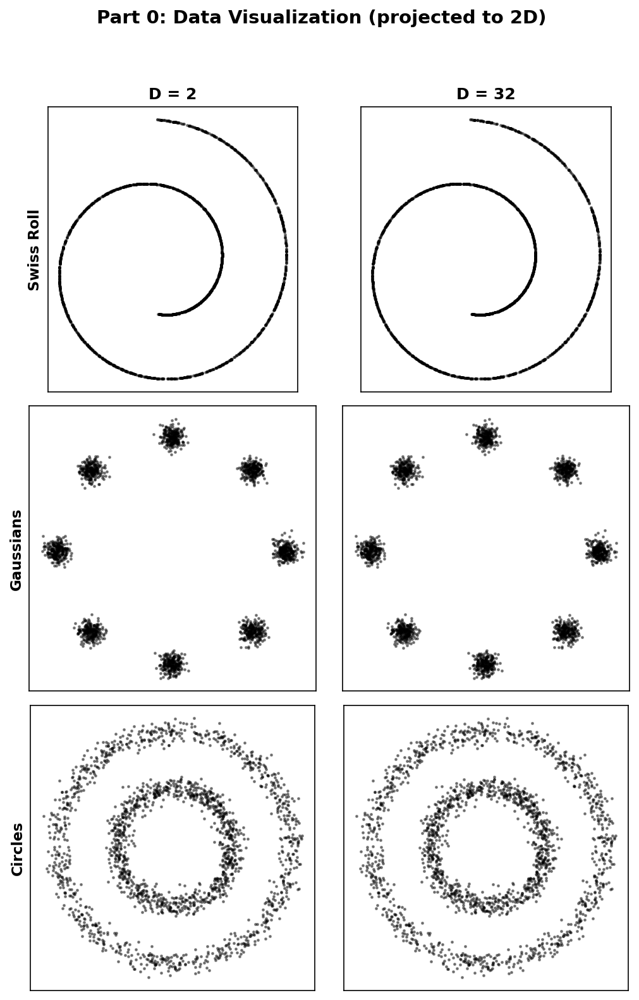 | 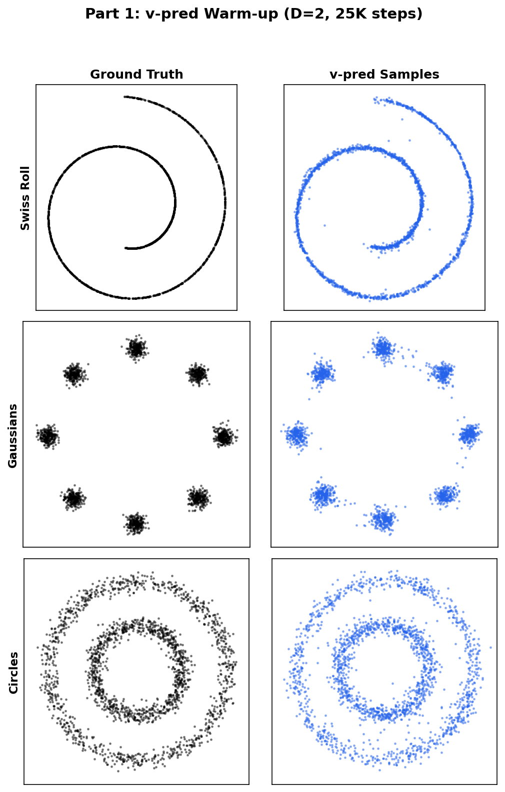 |

Orthogonal projection preserves structure: the 2D manifold looks identical at all D when projected back.

### 1b. V-pred warm-up (D=2)

**v-prediction with v-loss**: The model predicts `v = eps - x`. Training objective: `loss = MSE(model(z_t, t), eps - x)`.

Hyper-parameters:
- **Model**: 5-layer ReLU MLP, 256 hidden units
- **Time conditioning**: sinusoidal embedding of `t`, concatenated with input
- **Optimizer**: Adam, lr=1e-3
- **Batch size**: 1024
- **Training**: 25000 steps
- **Sampling**: Euler ODE, 50 steps

At D=2, v-pred generates recognizable structure for all 3 datasets.

---

## Part 2: Implement Flow Matching and Reproduce the Paper's Finding

### 2a. Training loss

Implement `training_losses()` in `src/diffusion.py`. Given a batch of clean data `x_0`:
1. Sample `t ~ U[0.01, 0.99]` and `eps ~ N(0, I)`
2. Form `z_t = (1-t) * x_0 + t * eps`
3. Get model prediction and compute MSE loss

The model can predict two quantities (**pred_type**):
- **x-prediction**: model outputs clean data estimate `x_hat`
- **v-prediction**: model outputs velocity estimate `v_hat = eps - x`

The loss can be computed in two spaces (**loss_type**): x-loss, v-loss.

When pred_type differs from loss_type, convert using the identity `z_t = (1-t)*x + t*eps`:

| From \ To | x | v |
|-----------|---|---|
| **x-pred** | direct | `(z_t - x_hat) / t` |
| **v-pred** | `z_t - t*v_hat` | direct |

**Question**: Which conversions involve division by values that approach zero? At what times `t`?

### 2b. Sampling (Euler ODE)

Implement `sample()`. Generate samples by integrating from noise (`t=1`) to data (`t=0`):

```python
z = randn(shape)            # start from noise (t ≈ 1)
for t in linspace(0.99, 0.01, 50):
    pred = model(z, t)
    v = convert_to_velocity(pred, z, t, pred_type)
    z = z + v * dt            # dt is negative (stepping toward t=0)
```

**Question**: Even if training uses matched pred/loss (no conversion during training), does sampling *always* require converting to velocity? Which pred types need conversion at sampling time?

### 2c. Run all 36 experiments

Train all 4 combinations (2 pred types x 2 loss types) across D = 2, 8, 32 on all 3 datasets:

```bash
python scripts/run_all.py --dataset swiss_roll
python scripts/run_all.py --dataset gaussians
python scripts/run_all.py --dataset circles
```

Generate sample visualizations:

```bash
python scripts/sample_and_visualize.py
```

This produces 6 figures (3 datasets x 2 loss types), each showing 2 pred-type rows x 4 dimension columns (GT + D=2, 8, 32).

### 2d. Results

**Reference results** (your results should be similar):

#### Swiss Roll
| x-loss | v-loss |
|---|---|
| 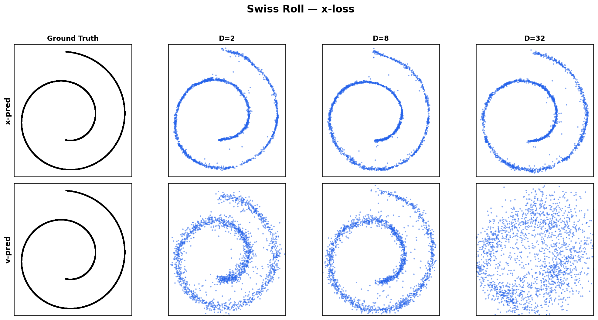 | 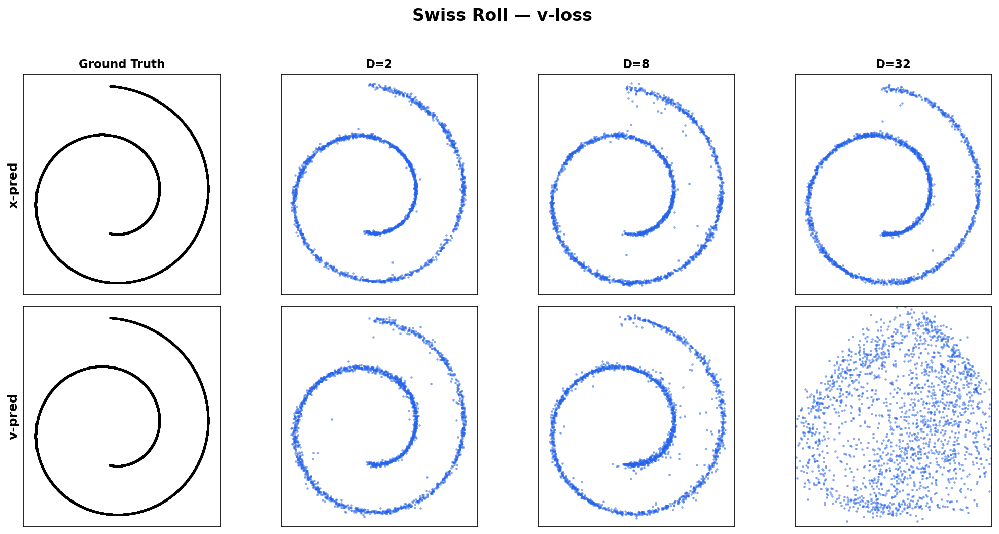 |

#### Gaussians
| x-loss | v-loss |
|---|---|
| 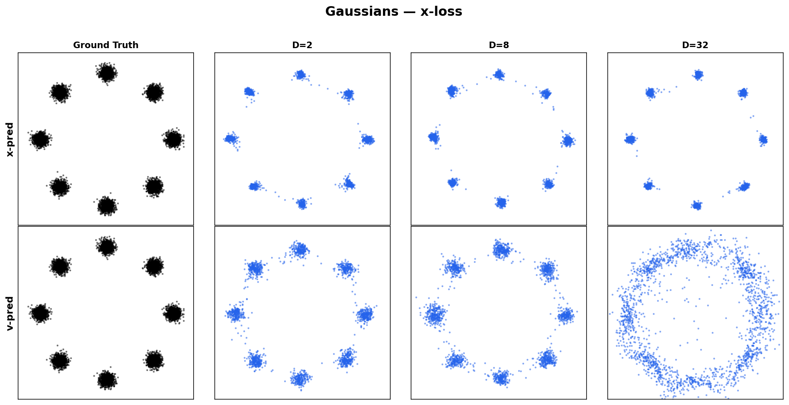 | 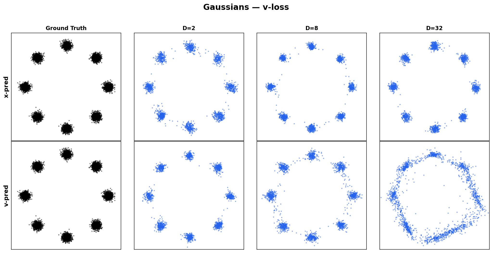 |

#### Circles
| x-loss | v-loss |
|---|---|
| 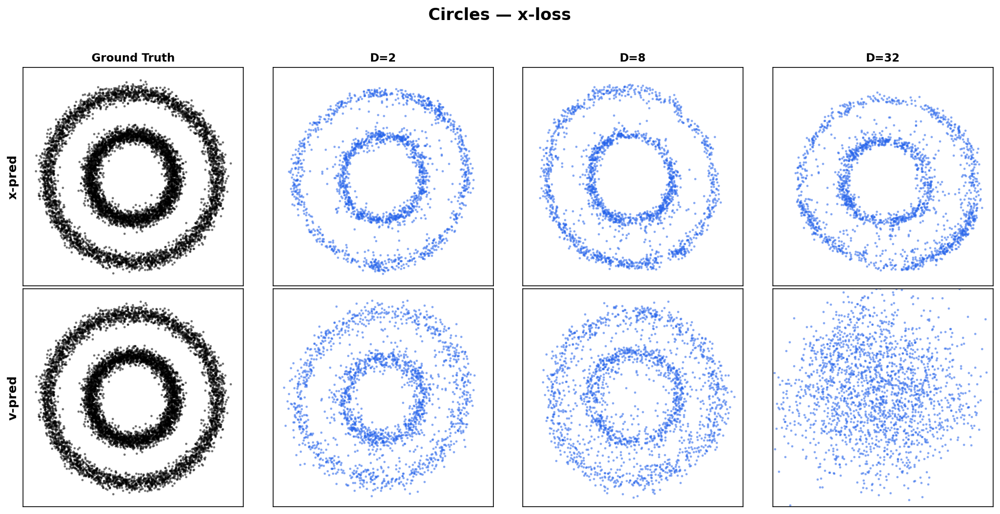 | 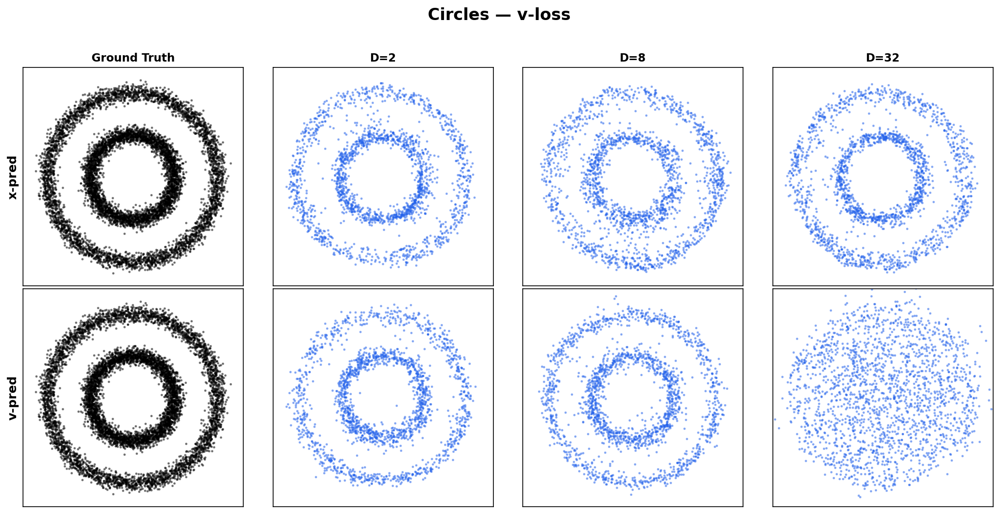 |

Each figure: rows = x/v-pred, columns = Ground Truth, D=2, 8, 32.

#### Training Loss Curves

| Swiss Roll | Gaussians | Circles |
|---|---|---|
|  | 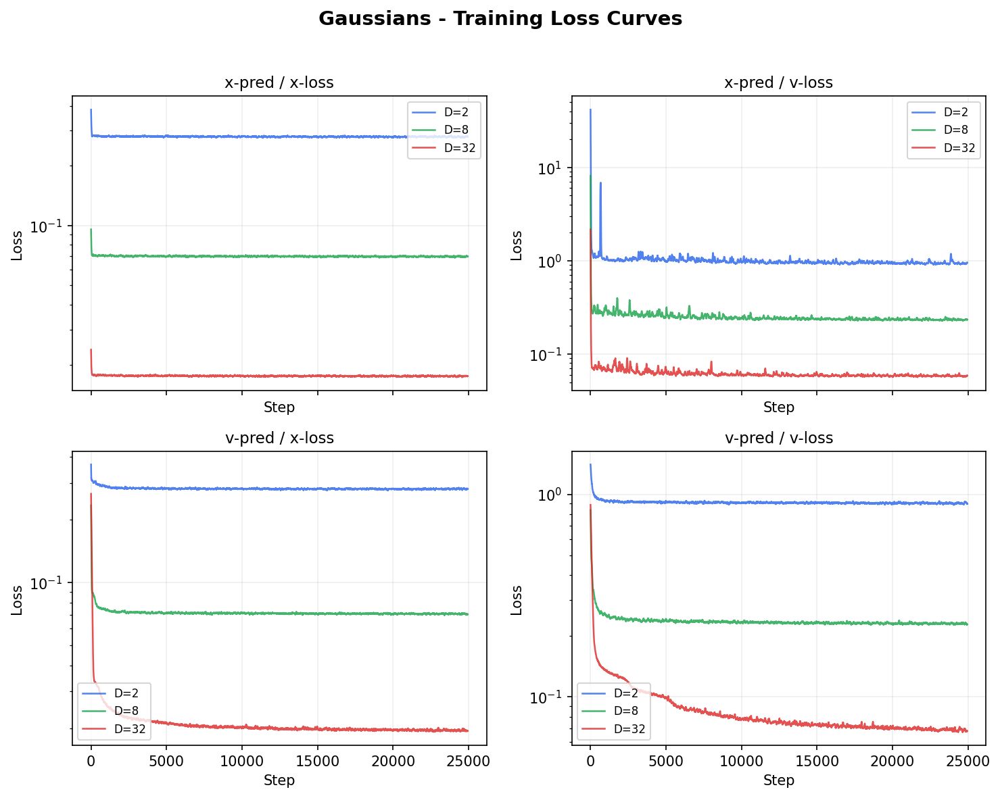 | 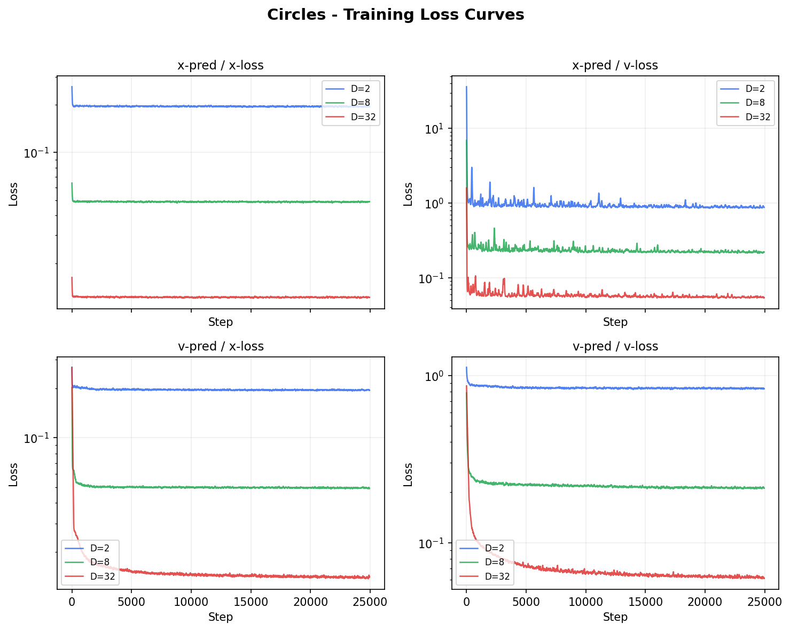 |

Each subplot shows the training loss over 25K steps for one pred/loss combination, with D=2 (blue), D=8 (green), D=32 (red) overlaid. Note the instability in certain combinations.

#### Effect of timestep clipping (T_EPS)

The conversion from x-pred to v-loss divides by `t`, which is singular at `t=0`. The table below shows the effect of clipping `t` to `[T_EPS, 1-T_EPS]` on x-pred/v-loss (swiss_roll, D=2, 25K steps):

| T_EPS | x-pred/x-loss | x-pred/v-loss | v-pred/v-loss | v-pred/x-loss |
|-------|---------------|---------------|---------------|---------------|
| 0 | 0.26 | **NaN** | 0.94 | 0.27 |
| 1e-5 | 0.28 | **357** | 0.88 | 0.26 |
| 1e-3 | 0.25 | **1.34** | 0.87 | 0.28 |
| 1e-2 | 0.26 | 0.96 | 1.00 | 0.25 |
| 5e-2 | 0.29 | 0.97 | 0.95 | 0.27 |

> **Takeaway:** Without clipping (T_EPS=0), x-pred/v-loss diverges to NaN. A value of T_EPS=1e-2 is sufficient to stabilize all combinations. Matched pred/loss combos (x/x, v/v) are unaffected by T_EPS since they involve no division.

### 2e. Questions

1. Which prediction type scales successfully to high ambient dimensions? At what dimension do the other prediction types begin to fail visibly?

   > **Sample answer:** x-prediction produces recognizable structure (spirals, modes, rings) at all dimensions including D=32. v-prediction degrades at D=32: the generated samples lose coherent structure and become diffuse, while x-prediction still produces clear patterns.

2. Does the choice of loss space (x-loss, v-loss) affect which prediction types succeed or fail? What does this tell you about what determines generation quality?

   > **Sample answer:** The choice of loss space has a minor effect on sample quality, but it does not change the overall pattern: x-prediction succeeds at all dimensions under both loss types, while v-prediction fails at high D under both. The dominant factor is the prediction type, not the loss space. This indicates that the failure is rooted in what the model must learn (the prediction target), not in how the training gradient is computed. Note: students may observe numerical instability in certain cross-combinations (e.g., x-pred/v-loss) due to division by t near zero, which is a separate implementation issue from the parameterization question.

3. Explain why the successful prediction type works at high D while the others do not. Consider the nature of each prediction target. (*Hint: think about the rank of each prediction target relative to the ambient dimension.*)

   > **Sample answer:** The data lies on a 2D manifold embedded in D-dimensional space. x-prediction asks the model to map noisy inputs to this 2D manifold, which is a rank-2 function regardless of D. The model only needs to learn a low-dimensional mapping, so a small MLP suffices. In contrast, v-prediction targets v = eps - x. Since eps is D-dimensional Gaussian noise, the velocity field is dominated by the noise component and is effectively a rank-D function. As D grows, the model must represent an increasingly complex function with the same capacity, causing failure. 
---

## Part 3: Can We Rescue v-prediction?

From Part 2, x-prediction works with a 256-hidden MLP and 25000 training steps at all dimensions. v-prediction fails at D >= 32.

**Question**: Is v-prediction fundamentally broken, or can it be rescued?

Read Section 3 of [RAE: Representation Autoencoder](https://arxiv.org/abs/2510.11690). The paper discusses the relationship between parameterization and dimension. Based on your reading, propose and test approaches that might make v-prediction work at D=32 on the swiss_roll dataset.

### 3a. Experiment: Scale up model capacity for v-pred at D=32

Fix the dataset to swiss_roll at D=32 (where v-pred starts failing) and systematically increase model capacity.

```bash
python scripts/run_vpred_scaleup.py --dataset swiss_roll
```

This sweeps:
- **hidden_dim**: 64, 128, 256, 512, 1024
- **pred_type**: x (baseline reference) and v

Generate comparison figures:

```bash
python scripts/plot_scaleup.py
```

### 3b. Results

**Reference results** (v-pred loss, v-loss, swiss_roll, 25K steps):

| hidden | params | v-pred loss | x-pred loss | ratio |
|--------|--------|-------------|-------------|-------|
| 64 | 29K | 0.275 | 0.064 | 4.3x |
| 128 | 91K | 0.086 | 0.057 | 1.5x |
| **256** | **313K** | **0.071** | **0.061** | **1.2x** |
| 512 | 1.1M | 0.066 | 0.057 | 1.2x |
| 1024 | 4.4M | **0.064** | 0.062 | **1.0x** |

x-pred baseline: ~0.06 regardless of model size.

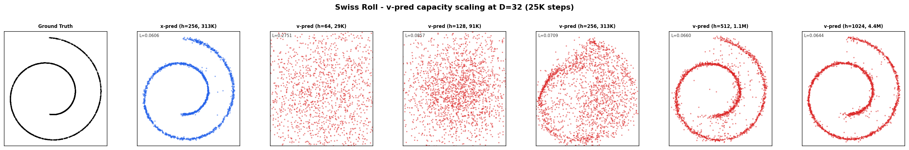

Rows = GT, x-pred(h=256), v-pred(h=64..1024). All at 25K steps.

### 3c. Questions

1. Based on your experiments, is v-prediction's failure fundamental or can it be overcome? Do your findings support or contradict your observations from Part 2? Explain.

   > **Sample answer:** It can be overcome. Part 2 showed that v-prediction fails at high D with the default model, while x-prediction succeeds. Part 3 shows that v-prediction is not fundamentally broken; it can match x-prediction quality, but only with a much larger model. This supports the rank argument from Part 2: v-prediction must learn a harder (rank-D) function, so it needs more parameters to do so.

2. What approach(es) did you try? Compare the compute cost between your approach and the default x-prediction setup to achieve similar sample quality at D=32.

   > **Sample answer:** We scaled up model capacity. With 25K training steps fixed, x-prediction reaches loss ~0.06 with h=256 (313K parameters). v-prediction reaches comparable loss only at h=1024 (4.4M parameters). The parameter ratio is 4.4M / 313K ~ 14x.

3. Compare how x-prediction and v-prediction respond to your changes. Do they behave the same way? Explain why or why not. (*Hint: consider what each parameterization must learn as a function of the ambient dimension D.*)

   > **Sample answer:** They behave very differently. x-prediction achieves loss ~0.06 at h=256 and does not improve with larger models or longer training; the loss plateaus because the x-prediction target is a rank-2 function (the 2D data manifold), so a small model already captures it fully. v-prediction, in contrast, steadily improves as hidden dimension increases from 64 to 1024, because v = eps - x is dominated by the D-dimensional noise component, making it a rank-D function that requires substantially more capacity to approximate.

4. In practice, v-prediction is used successfully in real image generation systems such as Stable Diffusion 3 and FLUX. Why might the situation be different for those models compared to these toy datasets?

   > **Sample answer:** In latent diffusion models, the data lives in a learned latent space where the intrinsic dimension is a significant fraction of the ambient dimension (e.g., a 4x64x64 latent has ambient dim 16384, but the intrinsic dimension of natural images in this space is much higher than 2). The ratio of intrinsic to ambient dimension is far larger than in our toy datasets (where intrinsic dim is always 2). When this ratio is reasonable, v-prediction does not suffer the same capacity penalty, and its other properties (e.g., balanced gradients across timesteps) become advantageous.

---

## Part 4: One-Step Generation with MeanFlow

### Motivation

From Part 2, x-pred with 50 Euler steps generates high-quality samples at D=32. But what if we need faster inference? As the number of Euler sampling steps decreases, quality degrades rapidly. At 1 step, the Euler ODE simply cannot traverse the full noise-to-data path. Multi-step sampling is fundamentally required for standard flow matching.

**Can we train a model that generates good samples in one step?**

### MeanFlow

[MeanFlow](https://arxiv.org/abs/2505.13447) (Sun et al., 2025) solves this by training the model to predict the **average velocity** over an interval `[r, t]`, not just the instantaneous velocity at time `t`. When the interval spans the entire path (`r=0, t=1`), a single step suffices.

The key idea: the model `u(z, t, h)` takes an additional input `h = t - r` (the horizon). At `h=0`, it predicts the instantaneous velocity (standard flow matching). At `h > 0`, it predicts the mean velocity over `[r, t]`.

**Training** uses a JVP (Jacobian-vector product) to compute the target:

```python
# Model predicts x (clean data), converted to velocity: u = (z - x_pred) / clip(t)
def u_fn(z, t, r):
    x_pred = model(z, t, t - r)
    return (z - x_pred) / clip(t, min=0.05)

u, du_dt = jvp(u_fn, (z, t, r), (v, 1, 0))   # forward-mode AD
u_tgt = v - (t - r) * du_dt                    # self-consistent target
loss = MSE(u, stop_gradient(u_tgt))
```

**Sampling** in `k` steps: partition `[1, 0]` into `k` intervals and apply `z_r = z_t - (t-r) * u(z_t, t, t-r)` at each.

### 4a. Implement MeanFlow

Implement the training loop in `src/diffusion_mf.py` and the model in `src/model_mf.py`. The model is the same MLP architecture as Part 2, but with an additional horizon embedding input `h`.

Key differences from standard flow matching:
- **Model predicts x** (clean data), converted to velocity via `u = (z - x_pred) / clip(t)` (same convention as Parts 1-3)
- **JVP required**: `torch.func.jvp` computes the directional derivative along the ODE trajectory
- **Adaptive weighting**: loss is normalized per-sample to balance different horizon scales

### 4b. Train and evaluate

```bash
python src/train_mf.py --train-steps 25000
```

Generate comparison figure:

```bash
python scripts/plot_meanflow.py
```

### 4c. Results

| Sampling Steps Degradation | MeanFlow vs Flow Matching |
|---|---|
| 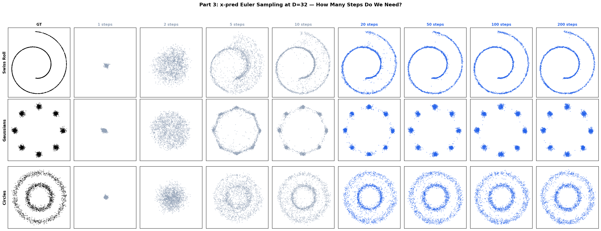 | 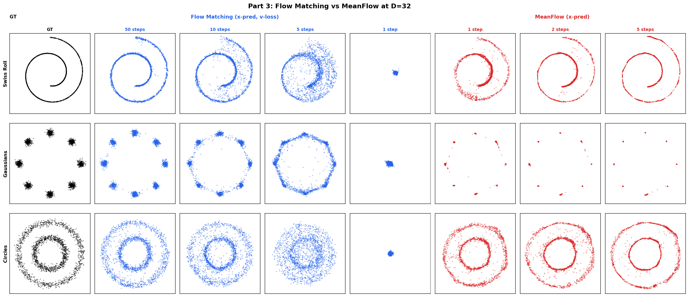 |

**Left figure**: x-pred quality degrades as Euler steps decrease. At 1 step, the output is a concentrated blob.

**Right figure (blue)**: Rectified flow at 50, 10, 5, 1 Euler steps. **(red)**: MeanFlow at 1, 2, 5 steps. Even at 1 step, MeanFlow produces recognizable structure. At 5 steps, quality approaches the 50-step flow matching baseline.

### 4d. Questions

1. Why did you choose this prediction type for MeanFlow? Connect your answer to your findings from Part 2.

   > **Sample answer:** We use x-prediction because Part 2 demonstrated that it is the only prediction type that scales reliably to high ambient dimensions. Since MeanFlow trains at D=32, v-prediction would fail for the same reasons identified in Part 2 (the prediction target complexity scales with D). x-prediction targets the low-rank clean data manifold and works regardless of dimension.

2. In your own words, describe the core idea behind MeanFlow. What does the model learn that is different from standard flow matching? Why does this enable one-step generation?

   > **Sample answer:** Standard flow matching trains the model to predict the instantaneous velocity at a single timestep t. Generating samples requires integrating this velocity field over many small steps. MeanFlow instead trains the model to predict the average velocity over a time interval [r, t] of variable length h = t - r. When h spans the entire trajectory (r=0, t=1), the mean velocity captures the full transport from noise to data in one vector. A single Euler step using this mean velocity moves the sample from noise directly to data, enabling one-step generation.

3. MeanFlow splits training between h=0 (standard flow matching) and h>0 (mean velocity). Why is the h=0 portion needed?

   > **Sample answer:** The h=0 case is standard flow matching, which trains the model to predict instantaneous velocities. This provides a grounding signal: the mean velocity for h>0 is defined in terms of the instantaneous velocity field, so without h=0 training, the model has no anchor for what the velocity field should look like at any given point. The h=0 portion ensures the model learns a valid velocity field, which the h>0 portion then integrates over progressively longer intervals.

4. Compare the training cost of MeanFlow to standard flow matching. Why is MeanFlow harder to train? What is the computational overhead of the JVP operation per training step?

   > **Sample answer:** MeanFlow uses similar step counts to standard flow matching (~25K), but each step is more expensive: the JVP computation via `torch.func.jvp` requires a forward pass through the model plus a tangent-linear pass, roughly 2x the cost of a single forward pass. The optimization problem is also harder because the model must simultaneously learn consistent velocity predictions across all horizon lengths h, not just at a single timestep.

5. Compare the MeanFlow-generated samples against the ground truth across all three datasets. Do you observe any differences or artifacts, particularly on the gaussians dataset? Describe what you see and explain why it occurs (or why it does not).

   > **Sample answer:** On swiss_roll and circles, 1-step MeanFlow produces recognizable structure (spiral, rings) but with some noise and imprecision compared to multi-step flow matching. At 5 steps, MeanFlow quality approaches the 50-step baseline. On the gaussians dataset, 1-step MeanFlow shows a distinct artifact: the generated points cluster tightly at the mode centers, with much less spread than the ground truth. This occurs because the MSE training objective encourages the model to predict E[x|z_t], the conditional mean. When a noise vector is equidistant from multiple modes, the model predicts the average, and at 1 step there is no opportunity for the ODE trajectory to diverge toward different modes. Multi-step sampling preserves within-mode diversity because the trajectory can follow different paths depending on intermediate states.

---

## Files

| File | Purpose |
|------|---------|
| `scripts/generate_data.py` | Generate 2D data and project to all ambient dims |
| `src/model.py` | 5-layer ReLU MLP with sinusoidal time embedding |
| `src/diffusion.py` | Flow matching: loss computation, conversions, Euler sampling |
| `src/dataloader.py` | Load precomputed projected data |
| `src/train.py` | Training loop (25000 steps, Adam) |
| `scripts/run_all.py` | Part 2: Run baseline experiments |
| `scripts/sample_and_visualize.py` | Part 2: Generate sample comparison figures |
| `scripts/run_vpred_scaleup.py` | Part 3: Run v-pred scaleup experiments |
| `scripts/plot_scaleup.py` | Part 3: Generate scaleup comparison figures |
| `src/diffusion_mf.py` | Part 4: MeanFlow training and sampling |
| `src/model_mf.py` | Part 4: MLP with horizon embedding for MeanFlow |
| `src/train_mf.py` | Part 4: MeanFlow training script |
| `scripts/run_sampling_steps.py` | Part 4: Sampling steps comparison figure |
| `scripts/plot_meanflow.py` | Part 4: MeanFlow vs RF comparison figure |

## References

- [Back to Basics: Let Denoising Generative Models Denoise](https://arxiv.org/abs/2511.13720): JiT paper on prediction parameterization
- [RAE: Rectified Autoencoder](https://arxiv.org/abs/2510.11690): Section 3 on parameterization and dimension
- [MeanFlow: One-Step Flow Matching](https://arxiv.org/abs/2505.13447): one-step generation via mean velocity
- [DiT: Scalable Diffusion Models with Transformers](https://github.com/facebookresearch/DiT): sinusoidal time embedding reference
- [SiT: Scalable Interpolant Transformers](https://github.com/willisma/SiT): Euler ODE sampling reference
